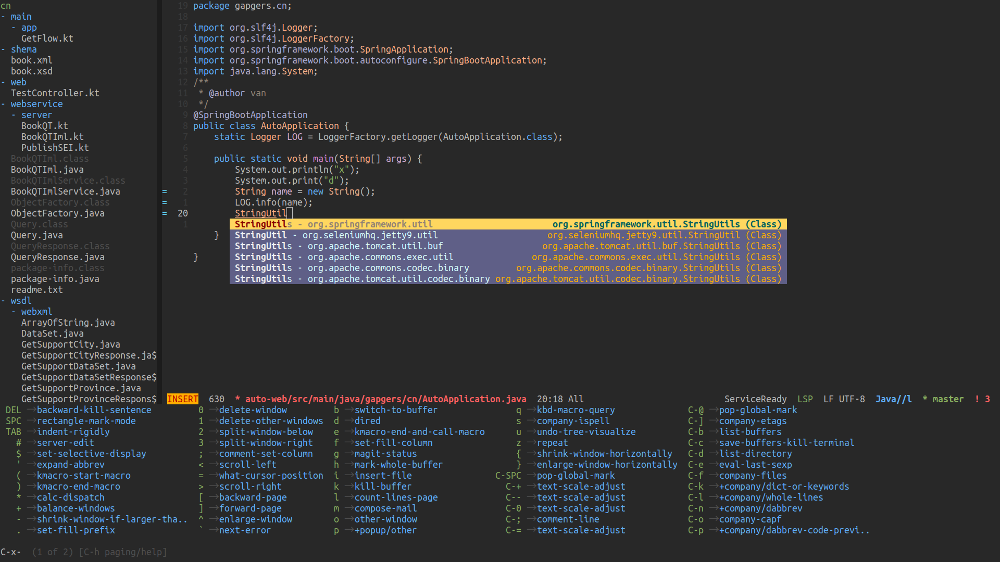

# INSTALL EMACS

Choose your operation system and install it.

<https://www.gnu.org/software/emacs/>

# CLONE DOOM

    git clone https://github.com/hlissner/doom-emacs.git ~/.emacs.doom/

# CLONE REPOSITORY

    git clone https://github.com/vanniuner/emacs-doom-private.git ~/.doom.d/

# DOOM INSTALL

Make sure that you have some setting in your terminal environment.

Set up a vpn if you need it.

    export http_proxy="ip:port"
    export https_proxy="ip:port"

Set your emacs cmd for doom install.

    export EMACS= $YOUR EMACS CMD PATH$

At last run below, this will take few minutes. And it depends on the quality of your network.

    ~/.emacs.doom/bin/doom install

# PLUGINS & FEATURES

1.  lsp-java

generate .project & .classpath files

    mvn eclipse:eclipse

1.  projectlombok
2.  ejc-sql
    
    config in the ../myconfig/db.el

    
    (ejc-create-connection
     "test-1"
     :classpath (concat "~/.m2/repository/com/oracle"
                        "/ojdbc6/11.2.0.3/ojdbc6-11.2.0.3.jar")
     :dbtype "oracle"
     :dbname "orcl"
     :host "--------------"
     :port "1521"
     :user "-------"
     :password "-----------"
     :separator "</?\.*>")

1.  evil-fcitx

2.  insert-translated-name
3.  plantuml uml
4.  number-region
5.  counsel-fzf-dir-function
6.  custom-set-faces
7.  some shortcuts

# DEPENDENCIES

<https://github.com/junegunn/fzf>

<https://github.com/BurntSushi/ripgrep>

<https://github.com/kostafey/ejc-sql>

<https://plantuml.com/>

<https://github.com/emacs-lsp/lsp-java>

<https://projectlombok.org/>

